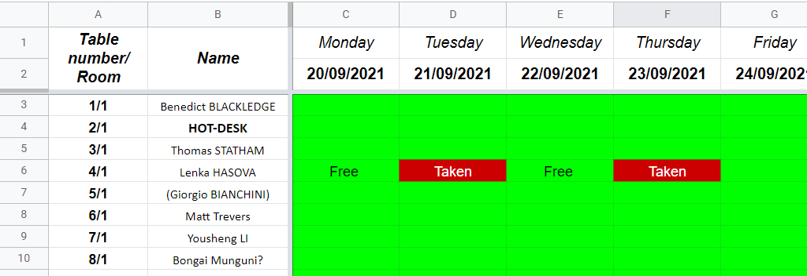

# Browns note board

Information and useful links for current Bristol Geography PGRs.

## What's new?

With COVID-19 restrictions being eased, the university has announced that we can **all come back to browns**. There are 2 conditions;
1. You should **always** wear a mask inside, unless you are eating/drinking or are the only one in the room.
2. You should also **take a lateral flow test (LFT) every 3-4 days**. You can get them for free in pharmacies, or order them online [here](https://www.gov.uk/order-coronavirus-rapid-lateral-flow-tests)

If your LFT test is positive or you have symptoms, please book a [PCR test](https://www.nhs.uk/conditions/coronavirus-covid-19/testing/get-tested-for-coronavirus/). If you do get COVID-19 and have been at the university, please let someone know. This could be your supervisor, member of staff or just send a message on PGR WhatsApp, or let one of our PGR representatives know, so we can organize the space and the students accordingly.

## Browns setting and hot-desking

To make people feel more comfortable about coming to Browns, we have created a check-in system. In the linked spreadsheet below, you can find not just the seating plan, but a also a calendar where you can indicate when you plan to be in browns. This way, everyone can see (1) how many people is currently in each room, (2) how many people will be in Browns, and (3) what desks are available for hot-desking. This should give everyone the freedom to decide if it's safe or comfortable for them to come into browns or not.

> [Browns desk check-in & hot-desking](https://docs.google.com/spreadsheets/d/1E2dg7tIT-jAFbEEQU-WUVP-tiqFN4De8_NhPHV7ueQk/edit#gid=0)

It's simple. Green cells represent available desk spaces and red cells represent booked desk spaces. If you plan to work from a desk in Browns, mark the desk you plan to work out in red. This applies to both your own desk and hot-desks but please do try to remain at your own desk.

## We are looking for PGR Social Representatives.

We have been lucky to have Viola and Tamsin who organized PGR social events last year. This position is now open for anyone who enjoys organizing parties and social events. This includes organising the summer party, Christmas party and casual meet-ups. Please let us know if you are interested.

## More information

If you are looking for further PGR related information, see the [PGR sharepoint site](https://uob.sharepoint.com/teams/grp-ggy-postgrad/Shared%20Documents/Forms/AllItems.aspx).This includes the PGR handbook, Training resources, list of HPT opportunities, notes from SSL meetings. If you can't find what you are looking for, ask your buddy, our PGR reps or your supervisor.

*Your PGR Reps*
* *Claude - claude.derijke-thomas@bristol.ac.uk*
* *Isolde - isolde.glissenaar@bristol.ac.uk*
* *Lenka - lenka.hasova@bristol.ac.uk*
